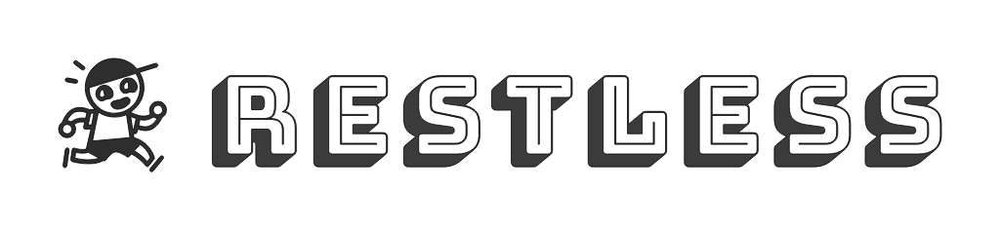

<!-- PROJECT LOGO -->
<p align="center">
  <a href="https://jddunn.github.io/restless/">
    
  </a>
  <p align="center">
    Always-on anti-malware software using malicious language processing (nlp-inspired) techniques.
        <br><br>
  <a href="./screenshots/Restless - CLI Full Scan Demo.gif">
    
    <br>
    <sup>Restless - CLI Full Scan Demo</sup>
  </a>
  </p>
</p>

<!-- TABLE OF CONTENTS -->
## Table of contents
* [About](#about)
  * [Screenshots and Results](#screenshots-and-results)
  * [Training Hierarchical Attention Network Model](#training-hierarchical-attention-network-model)
  * [Example CLI Usage](#example-cli-usage)
* [Background](#background)
  * [Concepts](#concepts)
  * [Architecture](#architecture)
* [Getting Started](#getting-started)
  * [Prerequisites](#prerequisites)
  * [Installation with pip](#installation-with-pip)
  * [Using Docker](#using-docker)
  * [Using Docker-Compose](#using-docker-compose)
* [Usage](#usage)
  * [CLI](#cli-usage)
  * [REST API](#rest-api-usage)
  * [Web UI](#web-ui-usage)
* [Docs](#docs)
  * [API docs (interactive)](#api-docs)
  * [App docs](#app-docs)
* [Roadmap](#roadmap)
* [Acknowledgements](#acknowledgements)


<!-- ABOUT THE PROJECT -->
## About

**Restless** is (or will be) a suite of security tools with these key features:

* Analysis of files for malware probabilty based on comparing the extracted metadata and file contents with trained Portable Executable data *(completed model with around 20 extracted PE header features with **~93% average accuracy in cross-validation training**)
* Analysis of system logs for abnormal activities / deviations *(not started)*
* Constant, efficient and ongoing analysis of system files / logs *(in-progress)*

No database is currently integrated with the code, but Spark clusters will be used along with Ray for distributed processing (eventually).

Restless aims to be fast and fully functional offline. The current Docker config is for Ubuntu-based machines, but can be modified for other platforms by editing the `Dockerfile` and `docker-compose.yml` (eventually, Docker images will be built for Mac and Windows and linked here for download).

## Screenshots and Results
<div>
  <h4>Feature Selection</h4>
  <p>We use Pearson coefficient to see how our features correlate with each other, and since we're doing binary classification, we can get the point-biserial correlation for each feature compared to our target feature (classification of "benign" or "malicious").</p>
  <p>Unlike conventional feature selection for regression, our model (HANN) takes a representation of documents as features (features ~= document sentences in this context). For HANN, we care about <b>any</b> feature that has some linear correlation, positive or negative.</p>
  <a href="./screenshots/model_results/Features Correlation Matrix for PE Header Data.png" style="left">
    
  </a>
  <a href="./screenshots/model_results/Top Features Correlation Matrix for PE Header Data (Minimum threshold of 0.1).png" style="right">
    
  </a>
</div>

---------------------------------------------------
### Training Hierarchical Attention Network Model
(With top extracted PE features correlated with class target, and 5KFold validation)
```
cd restless/components/nlp/hann
python train_hann.py
Training HANN model now..
Creating HANN model now, with K-Fold cross-validation. K= 1 and length:  4147 1037 for training / validation.
Train on 4147 samples, validate on 1037 samples
Epoch 1/3
 - 123s - loss: 0.6237 - accuracy: 0.6173 - val_loss: 0.4314 - val_accuracy: 0.8023
Epoch 2/3
 - 121s - loss: 0.3515 - accuracy: 0.8560 - val_loss: 0.3218 - val_accuracy: 0.8804
Epoch 3/3
 - 120s - loss: 0.2588 - accuracy: 0.9079 - val_loss: 0.2703 - val_accuracy: 0.8939
..
Metrics summed and averaged:  {'accuracy': 0.9328727060163897, 'loss': 2.3185255947187513, 'precision': 0.9461413757441932, 'recall': 0.9280079306100244, 'f1': 0.9356620828481846, 'kappa': 0.8656351205984505, 'auc': 0.9351519030411508}
The best performing model (based on F1 score) was number 3. That is the model that will be returned.
Training successful.
Saving model to /home/ubuntu/restless/restless/data/models/default.h5.
```
---------------------------------------------------
Stats of our best performing model (highest F1 score):
```
Model evaluation metrics: 

        Confusion matrix: 
                 benign malicious 
       benign     446.0      66.0 
    malicious       3.0     522.0 
         None
        Accuracy: 0.9334619093539055    Loss: 2.298195125052296
        Precision: 0.9942857142857143
        Recall: 0.8877551020408163
        F1 score: 0.9380053908355795
        Cohens kappa score: 0.8666998273038725
        ROC AUC score: 0.9405367937821009
```
(This is the current default model for HANN in this repo).
---------------------------------------------------
### Example CLI Usage
-i = file or folder to scan recursively
```
python restless/cli.py -i ../test_exes/
Using TensorFlow backend.
Succesfully loaded HANN model:  /home/ubuntu/restless/restless/components/nlp/hann/default.h5
..
2020-04-13 08:19:07 INFO Restless initializing. Running system-wide scan: False
2020-04-13 08:19:07 INFO Restless.Watcher is now watching over system and scanning new incoming files.
PEAnalyzer scanning:  ../test_exes/
2020-04-13 08:22:34 INFO Scanned ../test_exes/benign/CuteWriter.exe - predicted: 0.9961581826210022% benign and 0.0038418229669332504% malicious
2020-04-13 08:22:37 INFO Scanned ../test_exes/benign/7z1900-x64.exe - predicted: 0.8289633989334106% benign and 0.17103658616542816% malicious
2020-04-13 08:22:40 INFO Scanned ../test_exes/benign/Explorer++_1.exe - predicted: 0.04687594622373581% benign and 0.9531241059303284% malicious
2020-04-13 08:22:43 INFO Scanned ../test_exes/benign/setup-lightshot.exe - predicted: 0.9980466365814209% benign and 0.001953382510691881% malicious
2020-04-13 08:22:46 INFO Scanned ../test_exes/benign/WinCDEmu-4.1.exe - predicted: 0.01972261257469654% benign and 0.9802773594856262% malicious
2020-04-13 08:22:49 INFO Scanned ../test_exes/benign/putty.exe - predicted: 0.023633623495697975% benign and 0.976366400718689% malicious
2020-04-13 08:22:53 INFO Scanned ../test_exes/benign/peazip-7.1.1.WIN64.exe - predicted: 0.9818265438079834% benign and 0.018173446878790855% malicious
2020-04-13 08:22:56 INFO Scanned ../test_exes/malicious/bx89.exe - predicted: 0.1358533501625061% benign and 0.8641467094421387% malicious
2020-04-13 08:22:59 INFO Scanned ../test_exes/malicious/Bombermania.exe - predicted: 0.028919104486703873% benign and 0.9710809588432312% malicious
2020-04-13 08:23:02 INFO Scanned ../test_exes/malicious/2d.exe - predicted: 0.08720230311155319% benign and 0.9127976894378662% malicious
2020-04-13 08:23:05 INFO Scanned ../test_exes/malicious/ransomware.exe - predicted: 0.2670203447341919% benign and 0.7329797148704529% malicious
2020-04-13 08:23:08 INFO Scanned ../test_exes/malicious/3.exe - predicted: 0.0033065322786569595% benign and 0.99669349193573% malicious
2020-04-13 08:23:11 INFO Scanned ../test_exes/malicious/711.exe - predicted: 0.10913511365652084% benign and 0.8908648490905762% malicious
2020-04-13 08:23:14 INFO Scanned ../test_exes/malicious/311.exe - predicted: 0.10913511365652084% benign and 0.8908648490905762% malicious
2020-04-13 08:23:18 INFO Scanned ../test_exes/malicious/microsoft office 2007 service pack 2.exe - predicted: 0.0007832201081328094% benign and 0.9992167949676514% malicious
2020-04-13 08:23:21 INFO Scanned ../test_exes/malicious/1_1.exe - predicted: 0.0026582677382975817% benign and 0.9973416924476624% malicious
2020-04-13 08:23:24 INFO Scanned ../test_exes/malicious/0.exe - predicted: 0.09539982676506042% benign and 0.904600203037262% malicious
2020-04-13 08:23:27 INFO Scanned ../test_exes/malicious/se.exe - predicted: 0.04515210539102554% benign and 0.9548478722572327% malicious
2020-04-13 08:23:31 INFO Scanned ../test_exes/malicious/mcpatcher.exe - predicted: 0.0007832201081328094% benign and 0.9992167949676514% malicious
2020-04-13 08:23:34 INFO Scanned ../test_exes/malicious/tekdefense.dll - predicted: 0.7426907420158386% benign and 0.257309228181839% malicious
2020-04-13 08:23:37 INFO Scanned ../test_exes/malicious/Google_Adobe_FlashPlayer.exe - predicted: 0.9877290725708008% benign and 0.012270929291844368% malicious
2020-04-13 08:23:40 INFO Scanned ../test_exes/malicious/25000.exe - predicted: 0.8534355163574219% benign and 0.1465645134449005% malicious
```
---------------------------------------------------
While bulk testing needs to be done, Restless's malware classification seems to work fairly well, with few false negatives and relatively more false positives, which, given the nature of security, erring on the sie of caution in detecting threats, is sensible. 

Malicious executables obtained from [http://www.tekdefense.com/downloads/malware-samples/](http://www.tekdefense.com/downloads/malware-samples/). Training dataset taken from [https://github.com/urwithajit9/ClaMP](https://github.com/urwithajit9/ClaMP). 

## Background

### Concepts

Signature detection, the traditional method of antiviruses which creates the need to connect to online databases for incesstant updating, cannot keep up with the emergence of new malware, or even of known malware that's able to change itself, and while heuirstics-based approaches can combat polymorphic viruses while offering further degrees of granularity, they tend to give off so many false positives that they do more harm than good by wasting computing resources and increasing cognitive load.

The incorporation of machine learning (usually, natural langauge processing techniques although computer vision algorithms can also be applied) in antivirus software empowers them with a level of pattern recognition that previous approaches do not have. Rather than relying on known vulnerabilities / exploits or commonly re-used patterns of malicious code, restless and other ML-powered antiviruses can work well on classifying malware never seen before. This integration of NLP methods with information security has been dubbed malicious language processing by Elastic.

### Architecture

* Hierarchical attention network (LSTM) for binary classification (benign vs malicious) of EXE files via extracting PE metadata and strings from file contents (including obfuscated strings). The HANN model is perfect as it retains some element of document structure, which is important when analyzing file contents and looking for potentially destructive patterns in code.
* HANN trained for system API calls for benign vs malicious binary classification of logs (planned)
* K-means clustering for learning unsupervised patterns of abnormal / deviant logs (planned)
..

Restless's current classifications are implemented through a [hierarchical attention network](https://www.cs.cmu.edu/~./hovy/papers/16HLT-hierarchical-attention-networks.pdf), a type of recurrent neural network with an attention layer that can find the most important words and sentences to represent a document, as it is able to read the data in a bidirectional way to learn context.

The architecture from the paper has been modified in Restless's implenetation of HAN, in that a vector (array of features) is now acceptable (as well as scalars) for both "sentences" and "words" that build up the vocabulary.  

This allows us to represent any arbitrary set of features as a document that the HAN model can learn from, as GloVe (the pre-trained word embeddings) has weights for words as well as numbers. For example, in a word embeddings model like GloVe that considers numbers, a number like 8069 will have contextual meaning (as 8069 would be referenced a lot in computing-related documents).

Typically a document would be tokenized into sentences and then into words to fit the format the HAN model needs, but we can construct a representation of a document that corresponds to the metadata of our file. By extracting PE features like CheckSum, AddressOfEntryPoint, e_minalloc, and more, and considering each feature as a sentence, we can create a HAN classifier that reads executable files and their metadata like documents, and make use of the attention layer so it understands which features have more contextual importance than others.

Originally, Restless's classifier was going to extract strings (including obfuscated strings) from file contents of known malicious and benign files, and then build document representations from that dataset using the hierarchical attention neural network. However, collecting a dataset of executables (from trustworthy sources) is proving to be very time-consuming, so the current focus will focus on the file metadata representation construction.

<!-- GETTING STARTED -->
## Getting started

### Prerequisites

* Python 3.75+
* [Spark](Spark) (currently configured by Docker but unused by the code; training models will eventually be processed on Spark clusters)
* [TensorFlow](TensorFlow) / [Keras](Keras)
* [FastAPI](FastAPI)
* [Uvicorn](Uvicorn)
* [pdoc3](pdoc3) (fork of pdoc)

or

* [Docker](Docker) / [Docker-Compose](Docker-Compose)

### Installation with Pip

(Skip if using Docker)

```sh
pip install -r requirements.txt
```

Starts ASGI server wth reload (recommended to use a virtualenv with all the dependencies installed):

```sh
cd restless
python server.py
```

Restless's services will be running at port 4712 by default.

### Using Docker

(Skip to Using Docker-Compose if using Docker-Compose)

Build the image
```sh
docker build -t restless .
```

The example command will mount all the files in a Ubuntu machine into the container, so a full system scan of the host machine can be performed through the dockerized service.

```sh
docker run -p 4712:4712 -e APP_ENV=docker --mount source=home,target=/home/ubuntu/restless restless
```
^ When running the Docker container, an env var `APP_ENV` should be set to `docker` (this var only needs to be set if using Docker). The param `source` would ideally be set to the home / root dir of the host drive (for full protection) or is whatever dir you want to be scanning, and `target` must always point to the dir containing the Dockerfile and app files.

### Using Docker-Compose

(See the explanation above ^ to see how Docker will be mounting and communicating with your machine drive. If you're not using Ubuntu or a Debian-based Linux distro, then you'll need to edit `docker-compose.yml` to change the `source` and `target` paths under the `volume` key to reflect your OS's filepaths).

```sh
docker-compose up
```

and the app will be live at:

```sh
http://localhost:4712
```

## Usage

### CLI usage

You can use the CLI like this to scan folders / files for malware probability:
```sh
python cli.py -i /home/ubuntu/
```

### API usage

```
http://localhost:4712
````

At the moment, only the docs are accessible through the API. Eventually, we'll be able to send data to be analyzed via REST and get scan results.

### Web UI

In-progress


<!-- DOCS -->
## Docs

### API docs
FastAPI will automatically generate interactive API docs according to [OpenAPI Spec](https://swagger.io/docs/specification/about/).

```sh
http://localhost:4712/api_docs
```

### App docs 
Lib / app docs (uses `pdoc` for autogeneration); the below command generates docs and creates a reasonable folder structure
```sh
cd .
cd restless
pdoc --html restless --force; rm -rf docs; mv html docs; cd docs; cd restless; mv * .[^.]* ..; cd ..; rm -rf restless; cd ..
```

The docs will be stored in /docs in HTML, and will be accessible (served statically) here:
```
http://localhost:4712/app_docs/index.html
```

Example screenshot:


<!-- CODE -->
## Code

### Linting
```
black restless
```

<!-- TESTS -->
## Tests
```sh
python -m unittest discover
```

<!-- ROADMAP -->
## Roadmap
In order of desirability

* Add file classifier using same HANN model (extract strings, including obfuscated ones from file contents)
* Add analyzing system logs in real-time (will use k-means clustering to find logs with lots of deviation, or abnormal logs)
* Add dynamic analysis of executables by executing / testing files inside an isolated sandbox environmnet.
* Add generating MD5 hashes for new files and checking against known malware databases (like VirusTotal) - this might be the most important actually

<!-- PROJECT AUTHORS -->
## Project Authors
* [Johnny Dunn](https://github.com/jddunn) - johnnyddunn@gmail.com

<!-- ACKNOWLEDGEMENTS -->
## Acknowledgements / Other Contributions

* [Hierarchical Attention Networks for Document Classification](https://www.cs.cmu.edu/~./hovy/papers/16HLT-hierarchical-attention-networks.pdf)
* [ClaMP (Classification of Malware with PE headers)](https://github.com/urwithajit9/ClaMP)
* [Detecting Malware Across Operating Systems](https://www.opswat.com/blog/detecting-malware-across-operating-systems)
